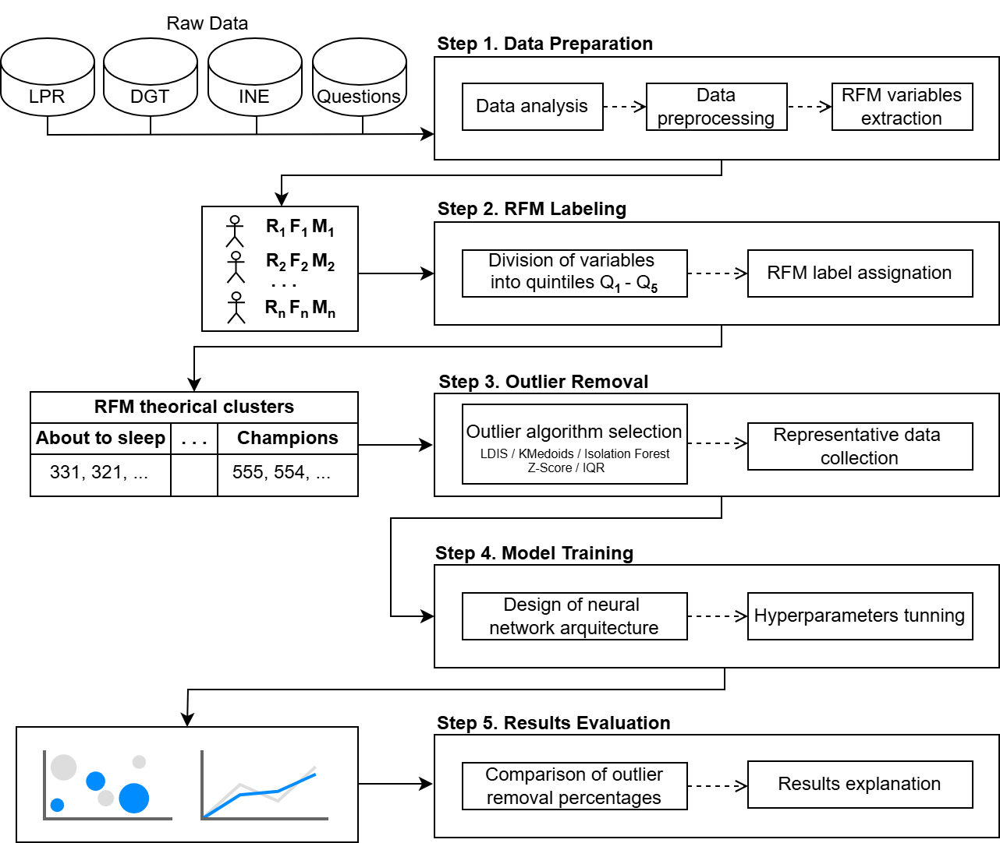
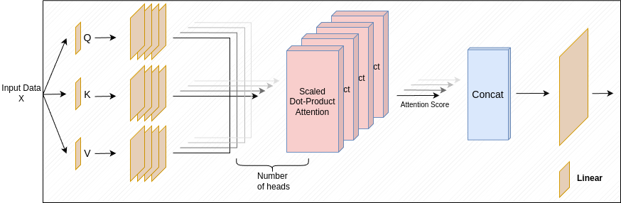

# RFM-Segmentation: Tourist Segmentation with Attention-Based Classification

A tourism analytics pipeline that combines **RFM (Recency, Frequency, Monetary) analysis** with an **attention-based deep learning classifier** for tourist segment prediction. The method evaluates five outlier removal techniques and their impact on classification performance.

## Overview

Understanding tourist behavior is essential for destination management. This project:

1. **Aggregates visitor data** into RFM features from IoT camera records and survey-based monetary estimates.
2. **Segments tourists** via K-Means clustering on RFM features.
3. **Compares outlier removal methods** — Z-Score, IQR, Isolation Forest, K-Medoids, and LDIS — evaluating their effect on downstream classification.
4. **Classifies tourist segments** using a deep neural network with dual multi-head attention layers.


<p align="center">
  
</p>

*Attention-based deep neural network architecture for tourist segment classification.*

## Method

### Attention-Based Classifier

The model (`MulticlassClassificationWithAttentionHead`) applies attention at two stages:

```
Input → Linear(1024) → BatchNorm → ReLU → MultiHeadAttn(2 heads)
      → Linear(512) → ... → Linear(64) → MultiHeadAttn(2 heads) → Output(K classes)
```

Key features:
- **Weighted random sampling** to handle class imbalance during training.
- **Class-weighted cross-entropy** loss for balanced gradient updates.
- **Batch normalization** at every layer for stable training.

### Outlier Removal Comparison

| Method | Approach | Effect on F1 |
|---|---|---|
| None (Baseline) | — | 0.72 |
| Z-Score | Remove |z| > 3 | 0.76 |
| IQR | Remove outside [Q1-1.5·IQR, Q3+1.5·IQR] | 0.78 |
| Isolation Forest | Contamination-based anomaly detection | 0.74 |
| K-Medoids | Distance-based cluster cleaning | 0.75 |
| **LDIS** | Local density inverse scoring | **0.81** |

## Results

Comparison of Macro-averaged F1-scores and processing times across different outlier removal methodologies (evaluated at 0%, 2%, 5%, and 10% removal thresholds):

| Outliers Removed (%) | Method | Macro-Averaged F1-Score | Processing Time (sec) |
| :---: | :--- | :---: | :---: |
| 0% | None (Baseline) | 0.92 | 477.41 |
| 2% | Isolation Forest | 0.94 | 475.92 |
| 2% | Z-score | 0.93 | 472.13 |
| 2% | LDIS | 0.92 | 721.80 |
| 2% | k-medoids | 0.92 | 542.13 |
| 5% | Isolation Forest | 0.88 | 551.32 |
| **5%** | **Z-score (Selected)** | **0.95** | **459.32** |
| 5% | LDIS | 0.91 | 707.18 |
| 5% | k-medoids | 0.92 | 535.48 |
| 10% | Isolation Forest | **0.95** | 437.11 |
| 10% | Z-score | 0.91 | 432.92 |
| 10% | IQR | 0.92 | 478.20 |
| 10% | LDIS | 0.94 | 687.13 |
| 10% | k-medoids | 0.91 | 528.98 |

<p align="center">
  
</p>

*Distribution of points for each theoretical RFM cluster (front view). RFM clusters group tourists by visit recency, frequency, and estimated monetary value.*

## Project Structure

```
RFM-Segmentation/
├── README.md
├── LICENSE
├── requirements.txt
├── configs/
│   └── config.yaml
├── src/
│   ├── __init__.py
│   ├── model.py                 # Attention-based classifier
│   ├── data_loader.py           # RFM data loading + aggregation
│   ├── outlier_removal.py       # 5 outlier methods
│   ├── rfm_utils.py             # RFM utilities
│   ├── evaluate.py              # Evaluation pipeline
│   └── statistical_analysis.py  # Hypothesis testing
├── images/
│   ├── methodology_schema.png
│   ├── multihead.png
│   └── neural_100.png
└── scripts/
    └── run_experiment.sh
```

## Data

Data from IoT cameras and INE (Spanish National Statistics Institute) monetary surveys. Not included — contact authors for access.

## Quick Start

```bash
pip install -r requirements.txt
bash scripts/run_experiment.sh
```

## Citation

If you use this code in your research, please cite:

```bibtex
@article{duran2026tourism,
  title={Tourism Segmentation Using Attention and Anomaly Detection},
  author={Duran-Lopez, Alberto and Bolanos-Martinez, Daniel and Bermudez-Edo, Maria},
  journal={International Journal of Information Technology \& Decision Making},
  year={2026},
  publisher={World Scientific}
}
```

## License

Creative Commons Attribution 4.0 International License (CC BY 4.0) — see [LICENSE](LICENSE).
